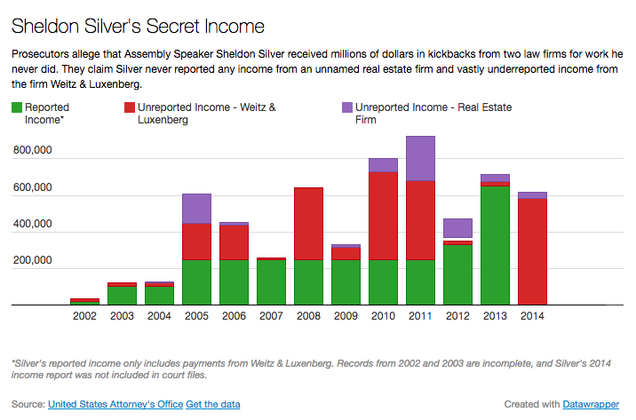
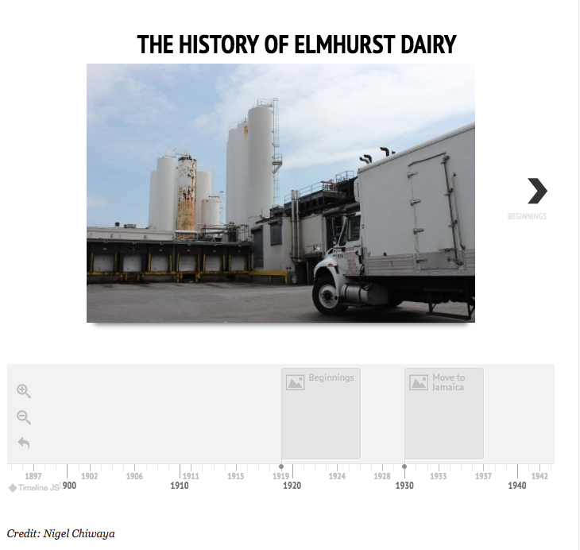
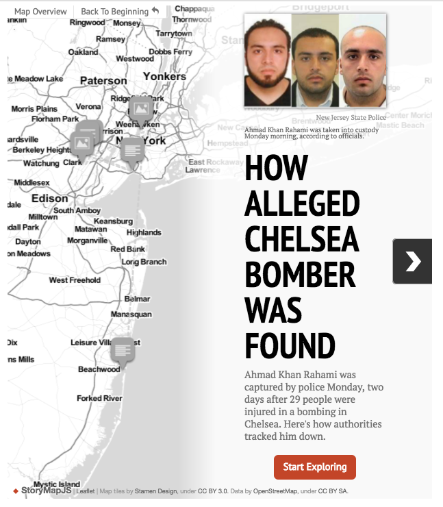

# Dataviz in the field
Five free tools journalists can use to create engaging data visualizations that wow readers and impress professors.

## Who am I?
I'm [Nigel Chiwaya](https://twitter.com/seenigel), a Graphics Reporter at the [Wall Street Journal](wsj.com). I'm also an [NYIT gradute](https://scontent-iad3-1.xx.fbcdn.net/v/t1.0-9/1910598_509492745867_8899_n.jpg?oh=10b64b451664ee378ab2e3df1e6821d6&oe=593E3A72) from the class of 2008.

## What is data visualization/interactive reporting?

Every reporter's definition is different, but to me, data visualization is simply telling a story using more than just words and photos. In print that might mean using charts or [graphics](images/hotspots.png), but on the web we've got so many more options.

# My Projects
- [**de Blasio Excuse Generator**](https://www.dnainfo.com/new-york/20150316/far-rockaway/are-you-chronically-late-try-our-mayor-de-blasio-lateness-excuse-generator)
- [**Second Ave Subway Timeline**](https://www.dnainfo.com/new-york/20150623/upper-east-side/timeline-all-things-built-while-we-waited-for-second-ave-subway)
- [**Public School Diversity**](https://www.dnainfo.com/new-york/20141210/mott-haven/map-how-diverse-or-not-is-your-kids-public-school)
- [**Where Can You Afford to Live Alone?**](https://www.dnainfo.com/new-york/20160112/inwood/map-heres-where-you-can-afford-live-alone)
- [**Where Exactly is Your Neighborhood?**](https://www.dnainfo.com/new-york/20150811/midtown/draw-where-you-think-your-neighborhood-borders-are-on-this-map)

A lot of those projects require knowledge of HTML, CSS, and Javasript, the coding languages of the web. But not everyone knows those languages. So here are a bunch of free tools you can use to create projects with little to no coding knowledge:

- [Datawrapper](https://www.datawrapper.de) (For charts)
- [Infogram](https://infogr.am/) (For charts and infographics)
- [JuxtaposeJS](https://juxtapose.knightlab.com/) (For before-and-after image comparison sliders)
- [TimelineJS](http://timeline.knightlab.com/) (For Timelines)
- [StorymapJS](https://storymap.knightlab.com/) (For Timeline map hybrids)
- [Carto](https://carto.com/) (**Advanced**: For maps)

# Datawrapper and Infogram

Both of these tools can be used to create bar graphs, line graphs, donut charts, etc.

When you're finished, both tools give you web code called an *embed code* that will let you display the graphic on your website.

**Demo time**: Using datawrapper, create a bar graph of public school test scores.

# JuxtaposeJS

[Example](https://www.dnainfo.com/new-york/20150326/east-village/massive-explosion-rips-through-east-village-building)
This tool lets you layer two images on top of each other, so that readers can compare them by swiping back and forth. These are great ways to dramatic or subtle changes.

**Demo time**: create a before and after slider of the cat before and after it out on a Santa hat.

# TimelineJS

[Example](https://www.dnainfo.com/new-york/20160826/jamaica/timeline-look-back-at-century-old-elmhurst-dairy-before-it-closes)
This tool creates timelines that use user can step through. You can include photos and even videos from YouTube. It's powered by a Google spreadsheet, so you can even work on it anywhere.

# StorymapJS

[Example](https://www.dnainfo.com/new-york/20160919/chelsea/timeline-how-ahman-khan-rahami-was-found)
This free tool is like the Timeline, but it's placed on a map, so you can use it to tell seqential stories based around locations.

# Carto
